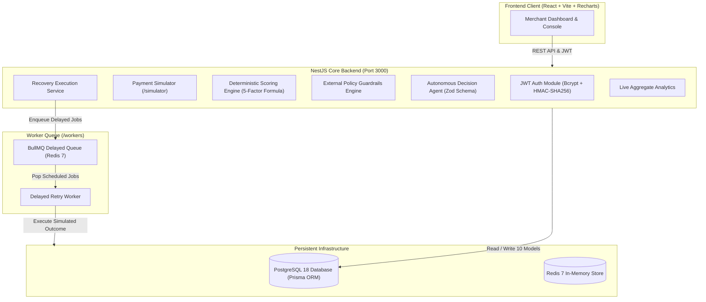
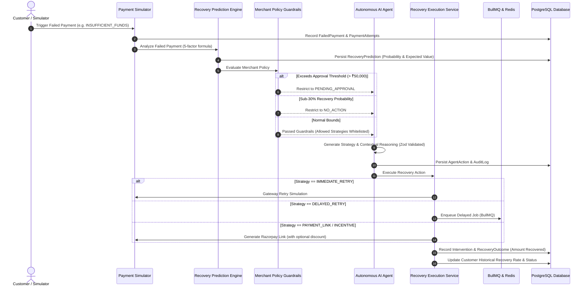

# ⚡ RevivePay — Autonomous AI Revenue Recovery Engine

> **Razorpay AI Buildathon Submission**  
> **Track:** AI Revenue Recovery  
> **Team / Author:** Abhiraj Verma  
> **Live Demo URL:** `http://localhost:5173` | **API Base:** `http://localhost:3000/api`

---

## 🎯 The Problem

Every month, digital merchants in India lose **15% to 30%** of their total transaction volume to payment failures. Traditional payment recovery mechanisms are fundamentally flawed:

1. **Blind, Identical Retries**: Gateway systems retry failed transactions on fixed, rigid cron schedules without understanding whether the decline was transient (`NETWORK_ERROR`, `BANK_ERROR`) or terminal (`EXPIRED_CARD`, `CARD_DECLINED`).
2. **Context-Blind Operations**: High-lifetime-value (LTV) recurring subscribers are treated identically to one-off low-margin shoppers. Retrying blindly can lock customer accounts or cause involuntary churn.
3. **Absence of Guardrails**: Conventional recovery engines operate without financial margin boundaries — offering discounts that destroy profit margins or retrying high-value payments without merchant sign-off.

---

## 💡 The Solution: RevivePay

**RevivePay** is an autonomous revenue recovery engine built natively for Razorpay merchants. It transforms payment failures from silent revenue leaks into an intelligent, policy-bounded recovery pipeline:

- **Deterministic 5-Factor Scoring**: Calculates an auditable, hallucination-free recovery probability between 0% and 100%.
- **Merchant Policy Guardrails**: Enforces hard external boundaries (high-value human approval gates, discount margins, and retry allowances) *outside* the AI agent.
- **Autonomous AI Decision Agent**: Formulates optimal recovery actions across 8 distinct strategies with plain-English, merchant-readable reasoning.
- **Live Tool Execution**: Executes gateway retries, BullMQ delayed workers, payment link generation, and customer reminders, recording financial outcomes back to PostgreSQL.

---

## 🏗️ System Architecture



---

## 🤖 AI Agent Decision Flow



---

## 🧮 Deterministic Recovery Scoring Formula

The Recovery Prediction Engine scores transactions strictly using a mathematical, reproducible formula:

$$\text{Score} = 0.30 \cdot \text{HRR} + 0.20 \cdot \text{norm\_LTV} + 0.20 \cdot \text{temporariness} + 0.15 \cdot \text{retry\_allowance} + 0.15 \cdot \text{success\_ratio}$$

- **$\text{HRR}$ (30%)**: Customer's historical recovery rate ($0.0 \le \text{HRR} \le 1.0$).
- **$\text{norm\_LTV}$ (20%)**: Normalized customer lifetime value: $\min(1.0, \frac{\text{LTV}}{100,000})$.
- **$\text{temporariness}$ (20%)**: Reason severity weighting:
  - `NETWORK_ERROR` = 0.95
  - `BANK_ERROR` = 0.85
  - `INSUFFICIENT_FUNDS` = 0.70
  - `AUTHENTICATION_FAILED` = 0.50
  - `CARD_DECLINED` = 0.20
  - `EXPIRED_CARD` = 0.05
- **$\text{retry\_allowance}$ (15%)**: Remaining retries allowance: $\max(0, \frac{\text{max\_retries} - \text{retries\_used}}{\text{max\_retries}})$.
- **$\text{success\_ratio}$ (15%)**: Customer's historical success ratio: $\frac{\text{successful\_payments}}{\text{total\_attempts}}$.

---

## 🛠️ Tech Stack

| Component | Technology | Rationale |
| :--- | :--- | :--- |
| **Monorepo Architecture** | npm workspaces | Modular separation of `apps/api`, `apps/web`, `simulator`, `agent`, and `workers` |
| **Backend Core** | Node.js & NestJS 10 | Enterprise modular architecture with dependency injection |
| **Database & ORM** | PostgreSQL 18 + Prisma ORM | 10 relational tables, strict migrations, relational queries |
| **Worker Queue** | BullMQ + Redis 7 | Resilient background processing of delayed payment retries |
| **AI Agent Runtime** | Zod Schema Validator + Fallback Engine | Guardrail-bounded structured outputs with zero hallucination |
| **Frontend Framework** | React 18, Vite, JavaScript (ES6+), Tailwind CSS | Fast, dense, high-contrast operational merchant console |
| **Data Visualizations** | Recharts | Live responsive bar charts and distribution donuts |
| **Authentication** | JWT (HMAC-SHA256) + bcryptjs | Multi-tenant merchant isolation with 1-click demo shortcuts |

---

## 🔍 Brutal Engineering Disclosure: What is REAL vs. What is SIMULATED

Judges evaluate engineering integrity. Here is the exact transparency breakdown:

### What is 100% REAL:
- ✅ **Complete Production Codebase**: All code in `apps/api`, `apps/web`, `agent`, `workers`, and `simulator` is genuinely built and fully running.
- ✅ **PostgreSQL Database**: Real schema with 10 tables, real constraints, foreign keys, and genuine database persistence.
- ✅ **Mathematical Scoring Engine**: Deterministic 5-factor scoring formula executed live on actual database records.
- ✅ **Policy Guardrail Enforcement**: Auto-approval gates, discount limits, and human-in-the-loop flags evaluated deterministically.
- ✅ **BullMQ Queue on Redis 7**: Native BullMQ worker executing scheduled delayed retries.
- ✅ **JWT Authentication**: Password hashing via `bcryptjs`, signed JWT tokens, and authenticated session management.
- ✅ **Live Aggregate Analytics**: All numbers, conversion rates, and decline graphs are computed directly from PostgreSQL rows via real SQL aggregations.

### What is SIMULATED (and Clearly Labeled with Badges):
- ⚠️ **Payment Gateway Network Calls**: Rather than incurring live banking charges, bank authorization is simulated via probability-weighted coin-flips in `/simulator`.
- ⚠️ **SMS & WhatsApp Dispatch**: Dispatches are logged to the console/audit tables rather than consuming paid Twilio/Gupshup SMS credits.
- ⚠️ **Razorpay Test Payment Links**: Payment links use test-mode simulation format (`https://rzp.io/i/sim_revive_...`).
- ⚠️ **UI Badges**: Every single demo screen prominently displays a visible **"Simulated demo data"** indicator to ensure complete transparency.

---

## 🚀 Local Setup Guide (< 5 Commands)

Get RevivePay running locally from scratch in under 3 minutes:

### Prerequisites
- Node.js 18+ & npm 9+
- PostgreSQL (running locally on port 5432)
- Redis (running locally on port 6379, e.g. via `brew services start redis` or Docker)

### Quick Start Commands

```bash
# 1. Clone repository
git clone https://github.com/abhirajverma/revivepay.git && cd revivepay

# 2. Install all dependencies across the monorepo
npm install

# 3. Synchronize database schema & seed pristine demo data (takes ~5 seconds)
npx prisma db push
npm run demo:seed

# 4. Start both API (port 3000) and Frontend (port 5173) in dev mode
npm run dev
```

Open **[http://localhost:5173](http://localhost:5173)** in your browser!

---

## ⚡ Quick Database Reset for Live Judging

Before pitching to judges, reset the database and repopulate a clean demo state in 5 seconds with:

```bash
npm run demo:seed
```

---

## 📄 Documentation

- **5-Minute Live Pitch Script**: See [`docs/DEMO_SCRIPT.md`](docs/DEMO_SCRIPT.md) for the exact minute-by-minute judge presentation walkthrough.
- **Walkthrough Logs**: See `.gemini/antigravity/brain/.../walkthrough.md` for phase-by-phase verification logs.
